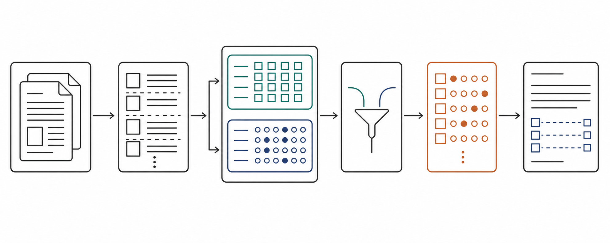
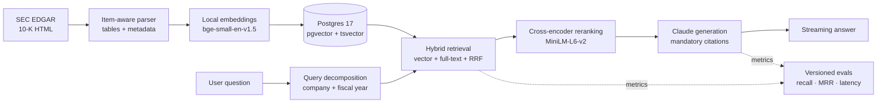
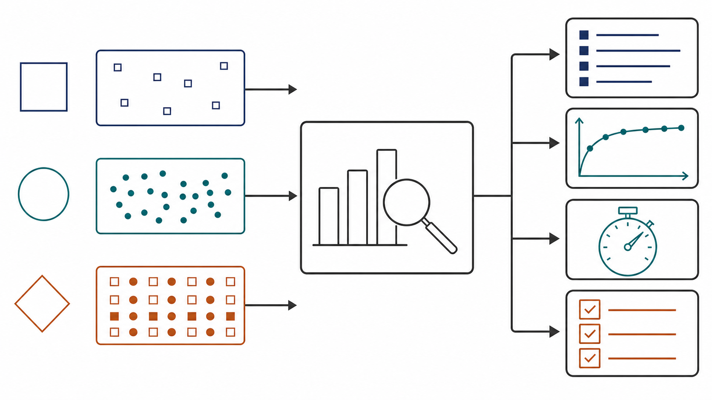

# secrag

Production RAG over SEC 10-K filings: hybrid retrieval, local reranking,
streamed answers with citations, and versioned evaluation runs.

[Live interface](http://145.239.196.98:8000/) ·
[Evaluation record](http://145.239.196.98:8000/evals) ·
[Health](http://145.239.196.98:8000/health)



## Architecture



The retrieval path stays local and costs `$0/query`. Postgres combines dense
vectors and lexical search; reciprocal-rank fusion builds a candidate set, then
the lightweight cross-encoder reranks the top 30. Generation is the only paid
stage and may be disabled independently.

| Layer | Implementation |
|---|---|
| Ingestion | SEC EDGAR download, Item-aware HTML/table parsing, ~400-token chunks |
| Storage | PostgreSQL 17, pgvector, `tsvector`, JSONB metadata |
| Retrieval | bge-small embeddings + full-text search + RRF + metadata scopes |
| Reranking | `cross-encoder/ms-marco-MiniLM-L6-v2`, local CPU inference |
| Generation | Claude streaming API with mandatory source citations |
| Service | FastAPI, Redis rate limits, Docker Compose |
| Evaluation | Quote-anchored golden set, retrieval and generation CI gates |

## Measured, not assumed



The committed golden set contains 58 questions over 19 filings and 10
companies. The lightweight reranker preserves the heavy model's recall while
making CPU deployment practical on a small VPS.

| Configuration | recall@5 | recall@10 | MRR@10 | p95 |
|---|---:|---:|---:|---:|
| Hybrid + decomposition | 0.606 | 0.721 | 0.531 | 236 ms |
| + BGE reranker v2-m3 | **0.708** | 0.763 | **0.643** | 140.3 s |
| + MiniLM-L6 reranker | 0.702 | **0.766** | 0.559 | **6.2 s** |

MiniLM-L6 gives nearly identical recall@5 with about **23× lower p95 latency**
than the previous CPU reranker. Full artifacts live in
[`evals/results`](evals/results/) and are checked by CI against
[`evals/thresholds.json`](evals/thresholds.json).

## Run locally

Requirements: Docker and [uv](https://docs.astral.sh/uv/).

```bash
docker compose up -d db redis
uv sync
uv run alembic upgrade head
uv run pytest

# API + minimal UI: http://localhost:8000
uv run uvicorn secrag.api.main:app --reload
```

Configuration is loaded from `.env`:

```dotenv
SEC_USER_AGENT=your-app/0.1 (you@example.com)
ANTHROPIC_API_KEY=sk-ant-...
GENERATION_MODEL=claude-haiku-4-5
RERANKER_MODEL=cross-encoder/ms-marco-MiniLM-L6-v2
```

Ingest and evaluate:

```bash
uv run python -m secrag.ingestion.download NVDA AAPL MSFT --years 2
uv run python -m secrag.ingestion.pipeline data/raw
uv run python -m secrag.evals.run --mode hybrid --rerank --label my-run
```

## API

- `GET /search` — vector or hybrid retrieval, filters, optional reranking
- `GET /ask` — streamed cited answer
- `GET /evals` — public evaluation record
- `GET /health` — database health

Deployment notes are in [`DEPLOY.md`](DEPLOY.md). The architecture decisions and
implementation plans are kept in [`docs/superpowers`](docs/superpowers/).
